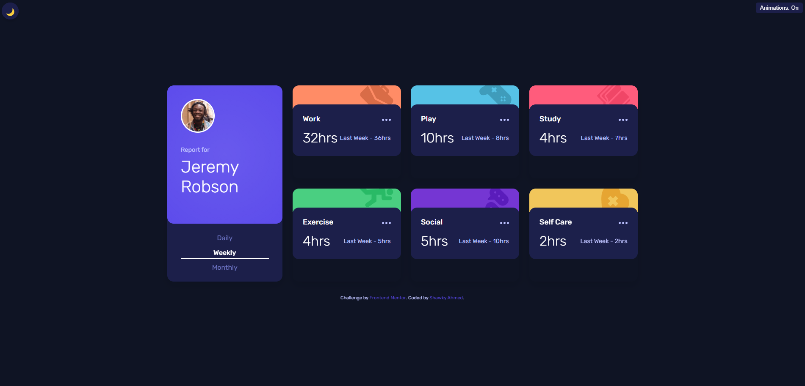
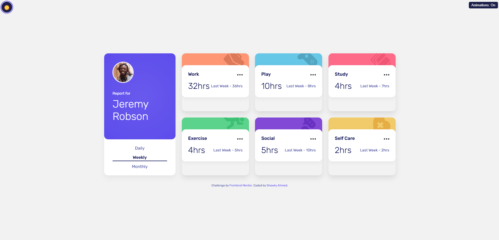
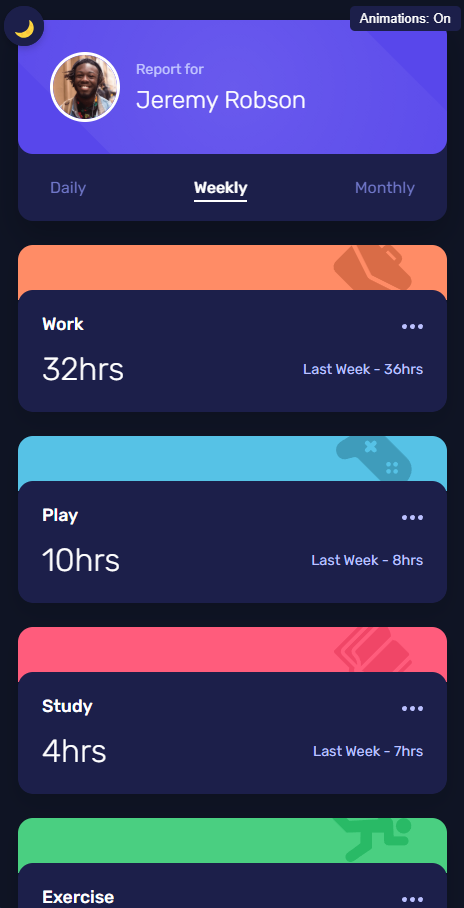

# Frontend Mentor - Time Tracking Dashboard Solution

This is a solution to the [Time tracking dashboard challenge on Frontend Mentor](https://www.frontendmentor.io/challenges/time-tracking-dashboard-UIQ7167Jw). Frontend Mentor challenges help you improve your coding skills by building realistic projects.

## Table of contents

- [Overview](#overview)
  - [The challenge](#the-challenge)
  - [Enhanced features](#enhanced-features)
  - [Screenshot](#screenshot)
  - [Links](#links)
- [My process](#my-process)
  - [Built with](#built-with)
  - [Animation implementation](#animation-implementation)
  - [Theme switching](#theme-switching)
  - [What I learned](#what-i-learned)
  - [Continued development](#continued-development)
  - [Useful resources](#useful-resources)
- [Author](#author)

## Overview

### The challenge

Users should be able to:

- View the optimal layout for the site depending on their device's screen size
- See hover states for all interactive elements on the page
- Switch between viewing Daily, Weekly, and Monthly stats

### Enhanced features

In addition to the base requirements, this solution includes:

- **Advanced animations**:
  - Entrance animations for dashboard elements with staggered timing
  - Number counter animations when switching timeframes
  - Card flip and transition effects
  - Hover animations for interactive elements
  - Icon float animations
- **Theme switching**:
  - Toggle between light and dark themes
  - Theme preference persistence using localStorage
  - System preference detection
  - Smooth transitions between themes
- **Accessibility features**:
  - Toggle for reduced motion
  - Enhanced focus states
  - ARIA labels for interactive elements
  - Responsive design across all device sizes

### Screenshot





### Links

- Solution URL: [Frontend Mentor solution URL](https://www.frontendmentor.io/solutions/time-tracking-dashboard-solution-with-advanced-features-qHSrtJzCrG)
- Live Site URL: [live site URL](https://qs3h.github.io/Time-tracking-dashboard-Frontend-Mentor/)

## My process

### Built with

- Semantic HTML5 markup
- CSS custom properties
- CSS animations and transitions
- Flexbox
- CSS Grid
- Mobile-first workflow
- JavaScript for interactivity
- LocalStorage for theme persistence

### Animation implementation

I implemented various animations to enhance the user experience:

```css
/* Example of staggered card animations */
.card {
  opacity: 0;
  animation: fadeIn var(--medium-transition) var(--ease-out) forwards;
}

.card:nth-child(1) {
  animation-delay: 1s;
}
.card:nth-child(2) {
  animation-delay: 1.1s;
}
.card:nth-child(3) {
  animation-delay: 1.2s;
}
```

```js
// Example of number counter animation
function animateCounter(element, targetValue) {
  element.classList.add("counting-animation");

  const duration = 1200; // ms
  const frameDuration = 1000 / 60;
  const totalFrames = Math.round(duration / frameDuration);

  let frame = 0;
  const startValue = 0;

  const counter = setInterval(() => {
    frame++;
    const progress = frame / totalFrames;
    const currentValue = Math.round(
      startValue + (targetValue - startValue) * progress
    );

    element.textContent = `${currentValue}hrs`;

    if (frame === totalFrames) {
      clearInterval(counter);
    }
  }, frameDuration);
}
```

### Theme switching

The theme switching functionality was implemented with user preferences in mind:

```js
// Save theme preference to localStorage
function saveThemePreference(isLightTheme) {
  localStorage.setItem("prefersDarkTheme", !isLightTheme);
}

// Check for saved preferences or system preference
function checkUserThemePreference() {
  const savedPreference = localStorage.getItem("prefersDarkTheme");

  if (savedPreference !== null) {
    const prefersDarkTheme = savedPreference === "true";
    applyTheme(prefersDarkTheme);
    return;
  }

  const prefersDarkMode = window.matchMedia(
    "(prefers-color-scheme: dark)"
  ).matches;
  applyTheme(prefersDarkMode);
}
```

### What I learned

This project provided valuable lessons in:

- CSS animation timing and sequencing for smoother user experiences
- Creating dynamic content with JavaScript
- Implementing theme switching with proper persistence
- Using CSS variables for flexible theming
- Enhancing accessibility with proper focus states and reduced motion options
- Applying subtle animations that enhance rather than distract from the user experience

One interesting challenge was implementing the number counter animation that needed to be synchronized with the timeframe changes:

```js
// Animate the counter when switching timeframes
timeframeButtons.forEach((button) => {
  button.addEventListener("click", () => {
    const timeframe = button.dataset.timeframe;
    if (timeframe === currentTimeframe) return;

    currentTimeframe = timeframe;
    generateCards(timeframe, true);
    setActiveTimeframe(timeframe);
  });
});
```

### Continued development

Areas I plan to focus on in future projects:

- Refining animation performance for lower-end devices
- Exploring more advanced CSS animation techniques like path animations
- Implementing GSAP for more complex animation sequences
- Adding unit tests for JavaScript functionality
- Improving accessibility features further

### Useful resources

- [MDN Web Docs on CSS Animations](https://developer.mozilla.org/en-US/docs/Web/CSS/CSS_Animations/Using_CSS_animations) - Comprehensive guide to CSS animations that helped with timing functions and keyframes.
- [CSS-Tricks Guide to Dark Mode](https://css-tricks.com/a-complete-guide-to-dark-mode-on-the-web/) - Excellent resource for implementing dark mode toggle.
- [A Modern CSS Reset](https://piccalil.li/blog/a-modern-css-reset/) - Used as a starting point for consistent styling.
- [Cubic Bezier Visualization](https://cubic-bezier.com) - Helpful for creating custom animation easing curves.
- [Designing for Reduced Motion](https://web.dev/prefers-reduced-motion/) - Guide for making animations accessible.

## Author

I am a frontend developer with a passion for creating user-friendly and accessible web experiences. I am excited to contribute to Frontend Mentor challenges and learn from the community. If you have any questions or need further assistance, feel free to reach out! 🚀

- Frontend Mentor - [@QS3H](https://www.frontendmentor.io/profile/QS3H)
- GitHub - [@QS3H](https://github.com/QS3H)
